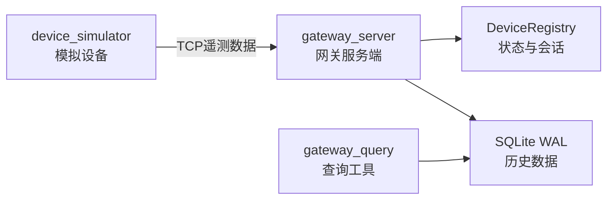

# Industrial Edge Gateway

基于 Linux C++17 实现的简易工业边缘数据采集网关，用于练习 TCP网络编程、多线程并发、设备会话管理、SQLite持久化、配置加载、日志记录和服务端资源生命周期管理。

项目完成了“设备接入 → 数据解析 → 状态管理 → 持久化 → 历史查询”的完整闭环。

## 项目架构



设备上报协议：

```text
deviceId,dataType,value\n
```

示例：

```text
deviceA,temperature,25.5\n
deviceA,speed,1000\n
```

## 主要功能

* 支持多个设备通过 TCP并发接入。
* 采用“一连接一线程”模型处理客户端。
* 使用换行符划分消息边界，处理 TCP黏包和半包。
* 限制单客户端接收缓冲区大小，避免异常数据持续占用内存。
* 校验设备ID、数据类型和浮点数格式，拒绝 `nan`、`inf`及尾随字符。
* 一条 TCP连接只能绑定一个设备ID。
* 使用递增 `sessionId`区分设备的新旧连接。
* 新会话接管后，旧会话不能继续更新状态或标记设备离线。
* 维护设备在线、离线、最后更新时间和不同类型的遥测值。
* 后台线程定期检测设备上报超时。
* 使用 SQLite预处理语句和参数绑定保存遥测数据。
* 使用 WAL模式和忙等待超时支持跨进程读写。
* 为设备最近数据查询建立复合索引。
* 提供独立的本地历史数据查询工具。
* 使用配置文件管理端口、超时、数据库路径、日志路径和缓存限制。
* 多线程日志输出由互斥锁保护。
* 回收已结束的客户端线程，避免线程对象持续积累。
* 捕获 `SIGINT`，支持 `Ctrl+C`优雅退出。
* 使用 CTest对核心模块进行自动化测试。

## 项目结构

| 路径                                 | 作用              |
| ---------------------------------- | --------------- |
| `src/server.cpp`                   | 网关服务端入口和整体流程控制  |
| `src/client.cpp`                   | 模拟设备客户端         |
| `src/common/socket_utils.cpp`      | 完整发送和按行接收       |
| `src/protocol/device_protocol.cpp` | 遥测协议解析与校验       |
| `src/gateway/device_registry.cpp`  | 设备状态、会话和超时管理    |
| `src/storage/sqlite_storage.cpp`   | SQLite初始化、写入和查询 |
| `src/config/gateway_config.cpp`    | 配置文件加载与校验       |
| `src/logging/logger.cpp`           | 线程安全日志          |
| `tools/gateway_query.cpp`          | 历史数据查询工具        |
| `tests/`                           | 自动化测试           |
| `config/gateway.conf`              | 服务端配置文件         |

## 环境依赖

适用于 Linux环境，需要：

* 支持 C++17的编译器
* CMake 3.16或更高版本
* POSIX Threads
* SQLite3开发库
* SQLite3命令行工具（可选）

Ubuntu安装命令：

```bash
sudo apt update

sudo apt install \
    build-essential \
    cmake \
    libsqlite3-dev \
    sqlite3
```

## 构建项目

```bash
cmake -S . -B build \
    -DCMAKE_BUILD_TYPE=Debug \
    -DBUILD_TESTING=ON
```

```bash
cmake --build build --parallel
```

构建后生成：

```text
build/gateway_server
build/device_simulator
build/gateway_query
```

## 配置文件

默认配置文件：

```text
config/gateway.conf
```

示例：

```ini
port=8888
timeout_seconds=5
database_path=data/gateway.db
max_pending_buffer_size=4096
log_path=logs/gateway.log
```

配置文件采用事务式加载：只有全部字段通过校验后才更新运行配置；任意字段错误时，原配置保持不变。

## 运行方法

### 1. 启动服务端

```bash
./build/gateway_server \
    config/gateway.conf
```

服务端会：

1. 加载并校验配置。
2. 初始化日志系统。
3. 创建监听套接字。
4. 初始化 SQLite数据表、WAL模式和查询索引。
5. 启动设备超时监控线程。
6. 接受并处理客户端连接。

### 2. 启动模拟设备

```bash
./build/device_simulator \
    deviceA \
    127.0.0.1 \
    8888
```

参数格式：

```text
device_simulator [设备ID] [服务器IPv4地址] [端口]
```

模拟器会交替发送温度和转速数据，并读取服务端回复。

可以同时启动多个模拟器：

```bash
./build/device_simulator deviceA 127.0.0.1 8888
```

```bash
./build/device_simulator deviceB 127.0.0.1 8888
```

### 3. 查询历史数据

查询指定设备最近5条记录：

```bash
./build/gateway_query \
    data/gateway.db \
    deviceA \
    5
```

输出示例：

```text
设备deviceA 最近5条数据:
id=10,type=temperature,value=26.3,sessionId=1,createdAt=2026-08-29 16:30:00
```

查询工具直接读取 SQLite数据库，不通过 TCP连接服务端，因此查询时服务端不会产生客户端连接日志。

## 服务端回复

| 回复                 | 含义           |
| ------------------ | ------------ |
| `OK`               | 数据校验并保存成功    |
| `ERROR`            | 协议格式或数值无效    |
| `ID_ERROR`         | 同一连接尝试更换设备ID |
| `FRAME_TOO_LARGE`  | 接收缓存超过配置限制   |
| `SESSION_REPLACED` | 当前连接已被更新会话替代 |
| `STORAGE_ERROR`    | 数据库保存失败      |

## 关键设计

### TCP消息边界

TCP只提供连续字节流，不保证一次 `send()`对应一次 `recv()`。

服务端将收到的字节追加到 `pendingBuffer`，循环查找换行符：

```text
收到字节
→ 追加到pendingBuffer
→ 找到\n
→ 取出完整消息
→ 删除消息及换行符
→ 继续处理剩余内容
```

没有换行符的尾部继续保留，等待下一次接收。

### 会话管理

同一设备断线重连时，新旧连接可能短暂同时存在。

每次连接都会获得递增的 `sessionId`。注册表只允许当前会话更新设备状态；旧会话退出时也不能把新会话错误标记为离线。

### 设备超时

设备最后更新时间使用：

```cpp
std::chrono::steady_clock
```

避免系统时间被调整后影响超时判断。

数据库创建时间使用：

```cpp
std::chrono::system_clock
```

用于生成可以转换为现实日期的 Unix时间戳。

### SQLite并发访问

同一进程内，`SQLiteStorage`使用互斥锁保护共享数据库连接。

不同进程之间依赖 SQLite提供的：

```sql
PRAGMA journal_mode = WAL;
PRAGMA synchronous = NORMAL;
```

并设置3秒忙等待超时，减少短暂锁竞争导致的立即失败。

最近数据查询使用索引：

```sql
CREATE INDEX IF NOT EXISTS
    idx_telemetry_device_id_id
ON telemetry(
    device_id,
    id DESC
);
```

### 优雅退出

收到 `Ctrl+C`后，信号处理函数只设置停止标志。

监听套接字和客户端套接字均设置1秒超时，使阻塞的 `accept()`和 `recv()`定期醒来检查停止状态。

主线程随后：

```text
退出accept循环
→ 关闭listenFd
→ 等待监控线程结束
→ join所有客户端线程
→ 销毁数据库和日志对象
→ 正常退出
```

## 自动化测试

运行全部测试：

```bash
ctest \
    --test-dir build \
    --output-on-failure
```

当前测试包括：

| 测试                      | 覆盖内容                         |
| ----------------------- | ---------------------------- |
| `protocol_tests`        | 合法协议、缺字段、空字段、尾随字符、`nan/inf`  |
| `device_registry_tests` | 设备注册、会话替换、旧会话拒绝、离线和超时        |
| `sqlite_storage_tests`  | 临时数据库、写入、查询、过滤、限制和排序         |
| `config_tests`          | 合法配置、非法配置、缺失文件和失败回滚          |
| `socket_utils_tests`    | 完整发送、按行接收、不完整消息和 `SIGPIPE`保护 |

当前结果：

```text
100% tests passed, 0 tests failed out of 5
```

## 当前边界

当前项目定位为用于学习和展示的边缘网关原型，不是商业生产系统。

目前尚未实现：

* TLS加密和客户端认证
* MQTT、Modbus等工业协议
* 应用层消息唯一ID和重复数据去重
* `epoll`或固定线程池
* 数据库存储周期清理
* 日志轮转
* 远程HTTP查询接口

当前“一连接一线程”模型适合少量设备和学习多线程生命周期。设备连接规模增大后，可以改为 `epoll + 线程池`。

## 项目收获

通过该项目完成了 Linux Socket、多线程同步、TCP消息分帧、设备会话管理、SQLite持久化、CMake模块化构建和自动化测试的综合实践，并理解了后台服务从启动、运行到优雅退出的完整资源生命周期。
